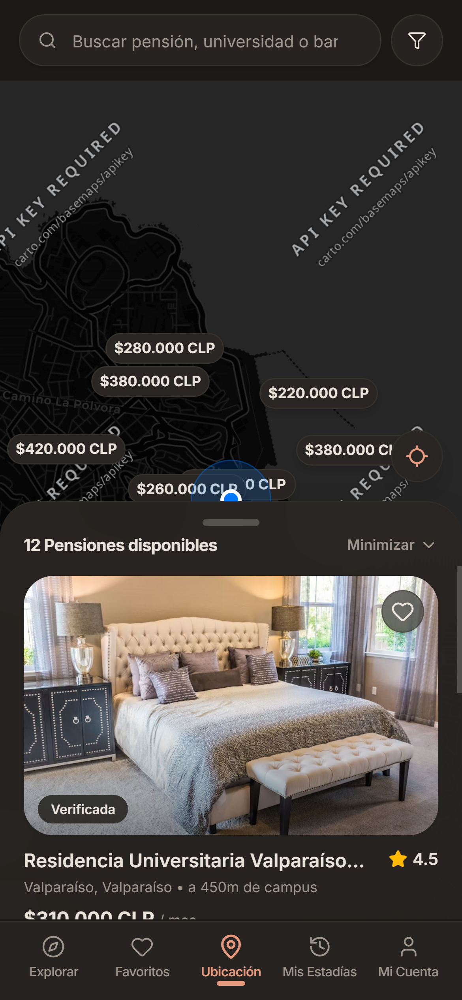
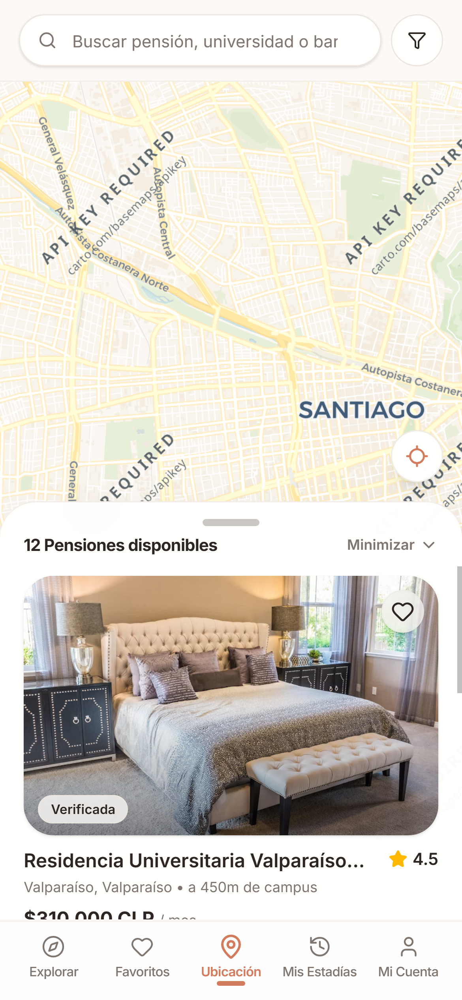

# BuscaTuNido Web

Mobile-first web application for BuscaTuNido, built with Next.js, Tailwind CSS, and shadcn/ui.

<p align="center">
  
  &nbsp;
  
</p>

## Public Deployments & Links

- **Web (Production)**: [https://buscatunido.vercel.app/](https://buscatunido.vercel.app/)
- **Backend API**: [https://buscatunido-api.onrender.com](https://buscatunido-api.onrender.com)
- **API Docs (Swagger)**: [https://buscatunido-api.onrender.com/api/docs](https://buscatunido-api.onrender.com/api/docs)

## Getting Started

### Prerequisites

- Node.js >= 20
- pnpm >= 9

### Environment Configuration

Copy `.env.example` to `.env.local` (or `.env`) and adjust values as needed:

```bash
cp .env.example .env.local
```

In production, Next.js internal rewrites automatically proxy `/api/*` requests to `https://buscatunido-api.onrender.com`.

### Commands

```bash
# Install dependencies
pnpm install

# Start development server (Turbopack)
pnpm dev

# Build production bundle
pnpm build

# Start production server
pnpm start

# Format and lint autofix (Biome)
pnpm run check

# Code quality check (Biome read-only)
pnpm run review
```
